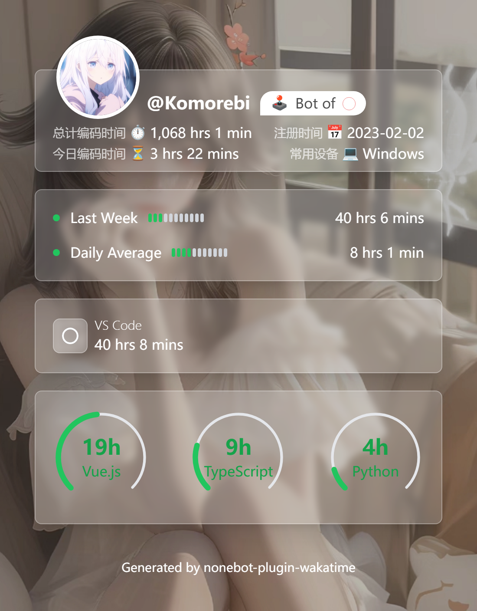

<!-- markdownlint-disable MD033 MD036 MD041 MD045 -->
<div align="center">
  <a href="https://v2.nonebot.dev/store">
    
  </a>
</div>

<div align="center">

# NoneBot-Plugin-Wakatime

_✨ NoneBot Wakatime 查询插件 ✨_

<a href="">
  
</a>

<a href="https://pdm.fming.dev">
  
</a>
<a href="https://github.com/nonebot/plugin-alconna">
  
</a>

</div>

## 📖 介绍

NoneBot Wakatime 查询插件。将你的代码统计嵌入 Bot 中

## 💿 安装

以下提到的方法任选 **其一** 即可

<details open>
<summary>[推荐] 使用 nb-cli 安装</summary>
在 Bot 的根目录下打开命令行, 输入以下指令即可安装

```shell
nb plugin install nonebot-plugin-wakatime
```

</details>
<details>
<summary>使用包管理器安装</summary>

```shell
pip install nonebot-plugin-wakatime
# or, use poetry
poetry add nonebot-plugin-wakatime
# or, use pdm
pdm add nonebot-plugin-wakatime
```

打开 NoneBot 项目根目录下的配置文件, 在 `[plugin]` 部分追加写入

```toml
plugins = ["nonebot_plugin_wakatime"]
```

</details>

## ⚙️ 配置

在项目的配置文件中添加下表中配置

> [!note]
> `client_id` 和 `client_secret` 均从 [WakaTime App](https://wakatime.com/apps) 获取  
> `redirect_uri` 的配置参见 [此处](#redirect_uri)

|            配置项             | 必填 |            默认值             |
| :---------------------------: | :--: | :---------------------------: |
|     wakatime\_\_client_id     |  是  |              无               |
|   wakatime\_\_client_secret   |  是  |              无               |
|   wakatime\_\_redirect_uri    |  是  |              无               |
|      wakatime\_\_api_url      |  否  | <https://wakatime.com/api/v1> |
|  wakatime\_\_register_route   |  否  |      /wakatime/register       |
| wakatime\_\_background_source |  否  |            default            |

### redirect_uri

> [!NOTE]
>
> `redirect_uri` 指绑定后跳转的页面，可以使用 `https://wakatime.com/oauth/test` 和个人域名

#### 使用 WakaTime 域名

- 在 WakaTime App 中的 `Authorized Redirect URIs` 添加：`https://wakatime.com/oauth/test`
- 在项目配置文件中写入：`wakatime__redirect_uri = https://wakatime.com/oauth/test`

#### 使用个人域名

> [!TIP]
>
> 使用个人域名可以启用自动注册，即发送绑定指令后无需进行二次操作，用于简化绑定流程。

- 使用 nb-cli 安装客户端类型驱动器：`nb driver install httpx`
- 在项目配置文件中写入：`driver=~fastapi+~httpx`
- 在 WakaTime App 中的 `Authorized Redirect URIs` 添加：`https://<your-domain>/wakatime/register`
- 在项目配置文件中写入：`wakatime__redirect_uri = https://<your-domain>/wakatime/register`

### background_source

`wakatime__background_source` 为背景图来源，可选值为字面量 `default` / `LoliAPI` / `Lolicon` 或者结构 `CustomSource` 。`LoliAPI` 和  `Lolicon` 均为随机背景图，`CustomSource` 用于自定义背景图。 默认为 `default`。

以下是 `CustomSource` 用法

在配置文件中设置 `wakatime__background_source` 为 `CustomSource`结构的字典

```env
wakatime__background_source = '{"uri": "https://example.com/image.jpg"}'
```

其中

- `uri` 可为网络图片 API，只要返回的是图片即可
- `uri` 也可以为 base64 编码的图片，如 `data:image/png;base64,xxxxxx` ~~（一般也没人这么干）~~
- `uri` 也可以为本地图片路径，如 `imgs/image.jpg`、`/path/to/image.jpg`
  - 如果本地图片路径是相对路径，会使用 [`nonebot-plugin-localstore`](https://github.com/nonebot/plugin-localstore) 指定的 data 目录作为根目录
  - 如果本地图片路径是目录，会随机选择目录下的一张图片作为背景图

## 🎉 使用

> [!note]
> 请检查你的 `COMMAND_START` 以及上述配置项。这里默认使用 `/`

### 绑定账号

首次绑定时向 Bot 发送 `/wakatime bind`，跟随链接指引进行绑定，成功后会跳转到 `redirect_uri` 处。

```shell
/wakatime bind [code]
```

### 解绑

```shell
/wakatime revoke
```

### 查询信息

```shell
/wakatime [@]
```

## 📸 效果图

默认背景图



## 📄 许可证

本项目使用 [MIT](./LICENSE) 许可证开源

```text
THE SOFTWARE IS PROVIDED "AS IS", WITHOUT WARRANTY OF ANY KIND, EXPRESS OR
IMPLIED, INCLUDING BUT NOT LIMITED TO THE WARRANTIES OF MERCHANTABILITY,
FITNESS FOR A PARTICULAR PURPOSE AND NONINFRINGEMENT. IN NO EVENT SHALL THE
AUTHORS OR COPYRIGHT HOLDERS BE LIABLE FOR ANY CLAIM, DAMAGES OR OTHER
LIABILITY, WHETHER IN AN ACTION OF CONTRACT, TORT OR OTHERWISE, ARISING FROM,
OUT OF OR IN CONNECTION WITH THE SOFTWARE OR THE USE OR OTHER DEALINGS IN THE
SOFTWARE.
```
